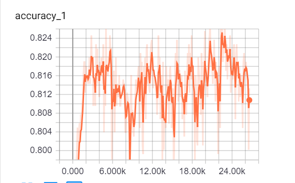
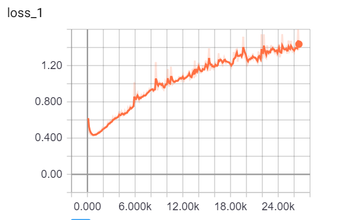

# Static realization of TEXT CNN
This repository mainly base on [link](https://github.com/dennybritz/cnn-text-classification-tf)
However, the link above only implement the one which use one-hot encoder for the words in its training data.
Here we use pretrained word vectors which trained by google's [word2vec](https://papers.nips.cc/paper/5021-distributed-representations-of-words-and-phrases-and-their-compositionality.pdf)

<<<<<<< HEAD
Even though we have the right model to train our word vectors, there is still a long way to go before we can get our own word vectors. The training process is very tedious and time-consuming. Fortunately, Facebook helps us trained these vecotors, you can download it [here](https://github.com/facebookresearch/fastText/blob/master/docs/crawl-vectors.md)

What's more, you can find the paper [here](http://arxiv.org/abs/1408.5882), which proposes using convolution neural network to do sentence sentiment classification.
=======
>This repository is based on the [repository](https://github.com/dennybritz/cnn-text-classification-tf)

## Requirements

- Python 3
- Tensorflow > 0.12
- Numpy
- pandas
>>>>>>> 5511d50d16bdb0a36a3866a187f968a9f7c6d805

Using different ways to encode words in our training data would get distinctive result, just as proposed by [Zhang](https://arxiv.org/abs/1510.03820)

Here we should the evaluation losses and accuracies with the one-hot embedding and word2vec embedding

## one-hot accuracy

## one-hot loss

## word2vec embedding accuracy

## word2vec embedding loss

from above four images, we can see, when we use word2vec, we achieve high accuray and a high convergence rate. 
